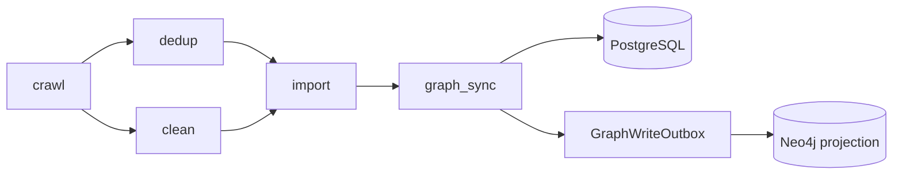

# Plan 03-02: Pipeline 设计对齐 + 新用户引导闭环

## 目标

1. 消除设计书与代码的阶段结构矛盾
2. 修复 dedup∥clean 并行为串行
3. 补全 JdStatus 状态机
4. 前端全功能引导闭环

## Task 1: 设计书 mermaid 更新 [docs]

**文件**: `docs/architecture/pipeline.md`

将 mermaid 从 3 阶段改为 5 阶段：



更新阶段表：

| 阶段 | 作用 |
|---|---|
| `crawl` | 按启用的数据源配置采集并写入原始 JD 记录 |
| `dedup` | 精确/近似去重（Redis content-hash + SimHash），标记 duplicate |
| `clean` | 文本清理、规范化、标题提取（依赖 dedup 完成后执行） |
| `import` | LLM 技能抽取 + PG 持久化 |
| `graph_sync` | Neo4j 图投影（outbox 模式） |

删除"不以五阶段或六阶段图为准"的自相矛盾语句。

**验证**: 文档 review，mermaid 渲染正确。

## Task 2: STAGE_DEPS 串行化 [backend]

**文件**: `backend/app/core/pipeline/orchestrator.py`

```python
STAGE_DEPS: dict[str, list[str]] = {
    StageName.CRAWL.value: [],
    StageName.DEDUP.value: [StageName.CRAWL.value],
    StageName.CLEAN.value: [StageName.DEDUP.value],  # 串行：等 dedup 完成
    StageName.IMPORT.value: [StageName.CLEAN.value],  # 串行：等 clean 完成
    StageName.GRAPH_SYNC.value: [StageName.IMPORT.value],
    StageName.TIMESERIES.value: [StageName.GRAPH_SYNC.value],
}
```

**验证**: `get_ready_stages` 单元测试 — clean 在 dedup 未完成时不 ready。

## Task 3: JdStatus.cleaned + Alembic 迁移 [backend + crawler]

**文件**:
- `crawler/persistence/models.py`: 增加 `cleaned = "cleaned"`
- `backend/alembic/versions/xxx_add_jd_status_cleaned.py`: ALTER TYPE 增加枚举值
- `backend/app/core/pipeline/executor.py`:
  - `execute_clean`: 成功后设 `jd.status = JdStatus.cleaned`
  - `execute_import`: 改读 `JdStatus.cleaned` 替代 `JdStatus.raw`

**验证**:
- 单元测试: clean 后 status=cleaned，import 读 cleaned 记录
- 集成测试: 完整 crawl→dedup→clean→import 流程，各阶段 status 正确转换

## Task 4: 前端标签 + timeseries 对齐 [frontend]

**文件**: `frontend/src/stores/pipelineConfig.ts`

```typescript
export const STAGE_LABELS: Record<string, string> = {
  crawl: '爬虫采集',
  dedup: 'SimHash去重',
  clean: '清洗标准化',
  import: 'LLM抽取+入库',    // 修正：含 LLM 抽取
  graph_sync: '图谱构建',
  timeseries: '时间序列',     // 新增：与后端对齐
}

export const ALL_STAGE_NAMES = ['crawl', 'dedup', 'clean', 'import', 'graph_sync', 'timeseries']
```

**验证**: 前端 DAG 渲染 6 个阶段卡片，timeseries 显示"时间序列"标签。

## Task 5: execute_import 移除 limit(100) [backend]

**文件**: `backend/app/core/pipeline/executor.py`

将 `s.query(JdRaw).filter(JdRaw.status == JdStatus.cleaned).limit(100).all()` 改为：
```python
clean_jds = s.query(JdRaw).filter(JdRaw.status == JdStatus.cleaned).all()
```

或改为可配置参数（从 pipeline config 读取 batch_size，默认 500）。

**验证**: 单元测试 mock >100 条 cleaned 记录，import 全部处理。

## Task 6: PipelineStageCard hover 说明 [frontend]

**文件**: `frontend/src/components/PipelineStageCard.vue`

在每个阶段卡片增加 `el-tooltip`，内容包含：
- 该阶段做什么（从 STAGE_DESCRIPTIONS 常量读取）
- 依赖哪些前置阶段
- 当前状态含义

```typescript
const STAGE_DESCRIPTIONS: Record<string, string> = {
  crawl: '从启用的数据源采集原始 JD 记录，写入 jd_raw 表',
  dedup: '精确哈希 + SimHash 模糊去重，标记重复记录为 duplicate',
  clean: 'HTML 剥离、空白规范化、标题提取（在去重后执行）',
  import: 'LLM 技能识别 + 标准化 + 验证，持久化到 PostgreSQL',
  graph_sync: '将 PG 数据同步到 Neo4j 图谱（outbox 模式防漂移）',
  timeseries: '聚合技能频率时间序列，供演化分析使用',
}
```

**验证**: hover 每个阶段卡片，tooltip 显示正确描述。

## Task 7: 触发对话框引导 [frontend]

**文件**: `frontend/src/pages/PipelineMonitor.vue`

在触发对话框中增加：
- `el-alert` 说明"触发后将按 DAG 顺序执行所有选中阶段"
- `selectedStages` 多选旁增加 `el-tooltip`："可选择部分阶段重跑（如仅重跑 import），未选阶段将标记为 skipped"
- 触发按钮增加前置条件检查提示："至少需要 1 个启用的数据源"

**验证**: 打开触发对话框，引导文案可见。

## Task 8: Cron 输入引导 [frontend]

**文件**: `frontend/src/pages/PipelineMonitor.vue`

在 Cron 表达式输入框旁增加：
- `placeholder="分 时 日 月 周，如 0 2 * * * = 每天凌晨2点"`
- `el-tooltip` 含 5 个常用示例
- 输入校验：5 字段格式检查，不合法时显示红色提示

**验证**: 输入非法 Cron 表达式，显示校验错误；hover 示例 tooltip 可见。

## Task 9: SSE 断开/降级用户提示 [frontend]

**文件**: `frontend/src/pages/PipelineMonitor.vue`

- SSE 断开时：页面顶部显示 `el-alert type="warning"` "实时推送已断开，已切换为轮询模式"
- SSE 重连成功时：alert 自动消失 + `ElMessage.success("实时推送已恢复")`
- 轮询模式下：SSE 标签变为 `el-tag type="info"` "轮询模式"

**验证**: 模拟 SSE 断开（断开网络/停止后端），alert 出现；恢复后消失。

## Task 10: DAG 串行 + cleaned 状态测试 [backend]

**文件**: `backend/tests/unit/test_pipeline_dag.py`

```python
def test_clean_waits_for_dedup():
    """clean 在 dedup 未完成时不应 ready。"""
    stages = [
        {"name": "crawl", "status": "completed"},
        {"name": "dedup", "status": "running"},
        {"name": "clean", "status": "pending"},
    ]
    ready = get_ready_stages(stages)
    assert "clean" not in ready

def test_clean_ready_after_dedup():
    """clean 在 dedup 完成后应 ready。"""
    stages = [
        {"name": "crawl", "status": "completed"},
        {"name": "dedup", "status": "completed"},
        {"name": "clean", "status": "pending"},
    ]
    ready = get_ready_stages(stages)
    assert "clean" in ready

def test_import_reads_cleaned_not_raw():
    """import 应读 status=cleaned 的记录。"""
    # mock JdRaw query, verify filter uses JdStatus.cleaned
    ...
```

**验证**: `pytest tests/unit/test_pipeline_dag.py` 全部 pass。

## 执行顺序

1. Task 1 (docs) — 无依赖，先行
2. Task 2 (STAGE_DEPS) — 后端核心变更
3. Task 3 (JdStatus + migration) — 需 Alembic，one-way door
4. Task 4 (前端标签) — 依赖 Task 2 的阶段名
5. Task 5 (limit 移除) — 依赖 Task 3 的 cleaned 状态
6. Task 6-9 (前端引导) — 独立，可并行
7. Task 10 (测试) — 依赖 Task 2-3

## 风险

| 风险 | 缓解 |
|---|---|
| Alembic 迁移改变 JdStatus 枚举，已有数据中 `raw` 记录需处理 | 迁移脚本中 UPDATE raw→cleaned WHERE clean_text IS NOT NULL AND status='raw'（已清洗但未标记的历史数据） |
| STAGE_DEPS 串行化后，已有 running run 的 stages JSON 中 clean 的 depends_on 不含 dedup | `_normalize_stages` 已处理：用 STAGE_DEPS 覆盖 stages JSON 中的 depends_on |
| 前端 ALL_STAGE_NAMES 增加 timeseries 后，旧 run 的 stages 不含 timeseries | `timelineStages` computed 已用 `takeByName` 补齐缺失阶段为 pending |