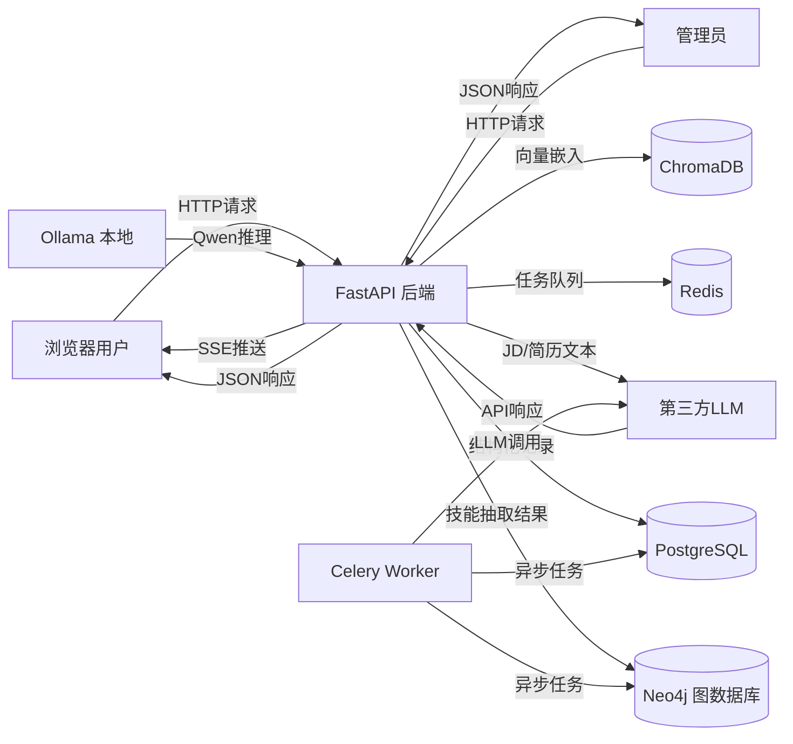

# 数据流图 (DFD)

项目: StarMap
生成时间: 2026-07-08

---

## Mermaid DFD

---

## 数据流详细标注

| # | 数据流 | 涉及PII | 跨境 | 加密状态 | 风险 |
|---|--------|---------|------|----------|------|
| 1 | 用户→后端: JD文本 | 可能含手机号/邮箱 | 否 (国内LLM) | ❌明文HTTP | P0 |
| 2 | 用户→后端: 简历PDF | 含姓名/手机/邮箱/经历 | 否 | ❌明文HTTP | P0 |
| 3 | 后端→星火API: JD文本 | PII已脱敏(mask_pii) | 否 (国内) | ✅HTTPS | P2 |
| 4 | 后端→DeepSeek: JD/简历 | **姓名未脱敏** | 否 (国内) | ✅HTTPS | **P0** |
| 5 | 后端→MiMo: JD/简历 | **姓名未脱敏** | 否 (国内) | ✅HTTPS | **P0** |
| 6 | 后端→Neo4j: 技能图谱 | 无PII | 否 | ❌明文(bolt) | P3 |
| 7 | 后端→PostgreSQL: 结构化记录 | 可能含来源URL | 否 | ❌明文(内网) | P3 |
| 8 | 后端→Redis: 任务/缓存 | 无PII | 否 | ❌明文(内网) | P3 |
| 9 | 后端→用户: JSON响应 | 无PII | - | ❌明文HTTP | P0 |
| 10 | 后端→用户: SSE推送 | 系统指标 | - | ❌明文HTTP | P2 |

---

## STRIDE 威胁分析

| 威胁类型 | 数据流 | 具体威胁 | 缓解状态 |
|----------|--------|----------|----------|
| **S**poofing (欺骗) | E1→P1 | 无认证，任何人可冒充 | ❌未缓解 |
| **T**amper (篡改) | E1→P1 | 无HTTPS，可中间人篡改 | ❌未缓解 |
| **R**epudiation (抵赖) | 全部 | 无审计日志，操作不可追溯 | ❌未缓解 |
| **I**nfo Disclosure | P1→E3 | LLM调用可能发送未脱敏PII | ⚠️部分(mask_pii仅3类) |
| **D**enial of Service | E1→P1 | 无速率限制，LLM端点可被滥用 | ❌未缓解 |
| **E**levation of Privilege | E2→P1 | Admin端点无权限控制 | ❌未缓解 |
