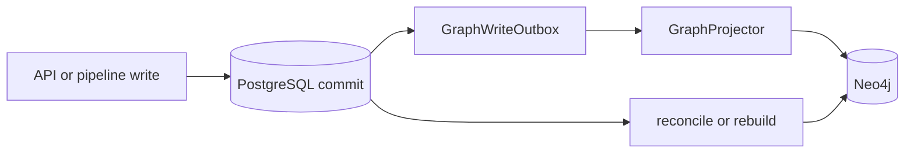

# 数据存储与投影

> 状态：活文档
> 最近核对：2026-08-15

## 存储职责

| 存储 | 角色 | 主要数据 |
|---|---|---|
| PostgreSQL | 业务记录唯一事实源 | 用户、审计、岗位、技能、抽取、匹配、学习、流水线、演化、审核 |
| Neo4j | 可重建的图查询投影 | Position、Skill 等节点及 REQUIRES、EVOLVES_TO 等关系 |
| Redis | 临时协调设施 | Celery broker/backend、缓存、限流、SSE/事件、refresh token 状态 |
| ChromaDB | 生产编排中的可选向量能力 | 技能语义匹配；开发环境默认不启用 |

## PG 到 Neo4j

`backend/app/services/graph_projector.py` 使用 PostgreSQL UUID 作为 `canonical_id` 投影节点和关系。业务写入先提交 PG，再以 best-effort 方式更新 Neo4j；投影失败不能回滚已提交的业务事实。

流水线通过 `GraphWriteOutbox` 记录图写入状态。`scripts/rebuild_graph.py` 与 `scripts/reconcile_graph.py` 用于重建、补齐和清理投影。`/positions` 从 PG 查询；`/graph/*` 从 Neo4j 提供图浏览语义，避免在同一接口中混合两个来源后再去重。



## 迁移与一致性

- ORM 变化先修改 `backend/app/models/`，再新增 Alembic revision。
- 不修改或重排已有 migration；使用 merge revision 解决多 head。
- 当前 head 以 `cd backend && poetry run alembic heads` 为准，不在活文档硬编码"最新迁移"。
- 图投影以 `canonical_id` 对齐，不以可变名称作为主键。
- 禁止让种子脚本直接制造无法回溯到 PG 的 Neo4j 权威数据。

## 运维验证

```bash
cd backend
poetry run alembic current
poetry run alembic heads

cd ..
python scripts/reconcile_graph.py --help
python scripts/rebuild_graph.py --help
```

运行任何重建或 reconcile 前先确认目标环境和备份；这些命令可能修改 Neo4j 投影。