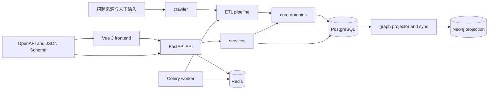

# 系统架构

> 状态：活文档
> 最近核对：2026-07-24

StarMap 采用单体后端加异步 worker 的分层架构。HTTP API、领域算法、数据访问和图投影分开维护；前端只通过契约化 API 访问业务数据。

## 后端分层

| 层 | 路径 | 职责 |
|---|---|---|
| HTTP | `backend/app/api/v1/` | 解析请求、依赖注入、调用服务、返回 Schema |
| Schema | `backend/app/schemas/` | 集中定义 Pydantic 请求与响应模型 |
| 服务 | `backend/app/services/` | 业务编排、数据库访问和 Neo4j 查询/投影 |
| 核心 | `backend/app/core/` | 抽取、演化、匹配、学习、流水线和校验逻辑 |
| 模型 | `backend/app/models/` | SQLAlchemy ORM；结构变化通过 Alembic 迁移 |
| 任务 | `backend/app/tasks/` | Celery 入口和同步到异步业务桥接 |

路由层不新增内联 Pydantic 模型；Neo4j 查询和写投影归服务层；可独立计算的领域逻辑归核心层。

## 前端分层

| 层 | 路径 | 职责 |
|---|---|---|
| 页面 | `frontend/src/pages/` | 路由级编排和页面布局 |
| 组件 | `frontend/src/components/` | 可复用视图和领域组件 |
| Composable | `frontend/src/composables/` | 生命周期、图交互、SSE 和页面逻辑 |
| Store | `frontend/src/stores/` | 跨组件状态和 API 操作 |
| API | `frontend/src/api/` | Axios 基础客户端和 OpenAPI 类型包装 |
| 校验 | `frontend/src/validation/` | JSON Schema 请求/响应校验与错误解析 |

认证启动由路由守卫调用 `ensureBootstrapped()`；受保护页面依赖服务端用户状态。新 API 调用优先使用生成类型，响应校验在开发环境报告结构漂移但不阻断页面。

## 业务数据流

- JD：采集或输入 -> 抽取 -> 归一化 -> 可信度校验 -> PostgreSQL -> Neo4j 投影。
- 简历：上传/文本 -> 独立简历抽取 -> 岗位匹配 -> 技能差距 -> 学习路径。
- 演化：抽取记录 -> 时间序列/快照 -> 差异与信任评分 -> 变更记录和路径。
- 质量：抽取、图谱、审核和流水线数据 -> 聚合服务 -> 仪表盘与告警。

## 横切约束

- API 契约先于前后端实现变更。
- 错误响应统一为 `{detail, code, timestamp, fields?}`。
- 数据模型变更必须附带 Alembic 迁移。
- 每个技能抽取结果必须包含可追溯来源和可信度信息。
- 运行状态通过数据库持久化，Redis 只承担缓存、队列和短期协调职责。