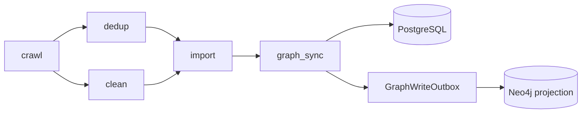

# 数据流水线

> 状态：活文档
> 最近核对：2026-07-24

StarMap 当前的 ETL 调度由 `backend/app/core/pipeline/orchestrator.py` 维护状态，`executor.py` 执行阶段，`backend/app/tasks/celery_app.py` 通过 Celery 分发任务。

## 当前阶段



| 阶段 | 作用 |
|---|---|
| `crawl` | 按启用的数据源配置采集并写入原始 JD 记录 |
| `dedup` | 精确/近似去重（Redis content-hash + SimHash），标记 duplicate |
| `clean` | 文本清理、规范化、标题提取（依赖 dedup 完成后执行） |
| `import` | LLM 技能抽取 + PG 持久化 |
| `graph_sync` | Neo4j 图投影（outbox 模式防漂移） |

`executor.py` 仍包含部分旧的细粒度执行函数，供兼容和组合调用；调度事实以 `STAGE_EXECUTORS` 与 `StageName` 为准。`timeseries` 为可选扩展阶段，不属于核心 ETL DAG。

## 运行与恢复

- `PipelineRun.stages` 持久化阶段状态、时间、进度、处理量和错误。
- 管理员可触发、取消、重试、恢复和处理卡死 run。
- Redis STOP flag 与数据库状态共同阻止取消后的阶段继续分发。
- SSE `/pipeline/events` 提供实时更新，轮询端点作为降级路径。
- 单阶段失败按依赖关系标记后续阶段；所有阶段终态后才结束 run。

## 其他流水线

- 闭环流程：`loop_orchestrator.py` 执行 JD -> 抽取 -> 图更新 -> 匹配 -> 学习路径。
- 求职者分析：`/pipeline/analyze` 以 SSE 返回简历解析、技能抽取、匹配和推荐过程。
- 演化流程：`run_evolution_pipeline` 是独立 Celery 周期任务，不属于当前三阶段 ETL DAG。
- 技能时间序列由演化服务刷新，不应被文档误写为当前 ETL 的必选阶段。

## 验证

```bash
# 需要已启动后端和管理员 token
python tests/e2e/pipeline_smoke_test.py
python tests/e2e/smoke_test.py --base-url http://localhost:8000 --all
```

单元测试应覆盖 DAG 就绪判断、失败传播、取消、重试、恢复、幂等和 outbox 状态转换。