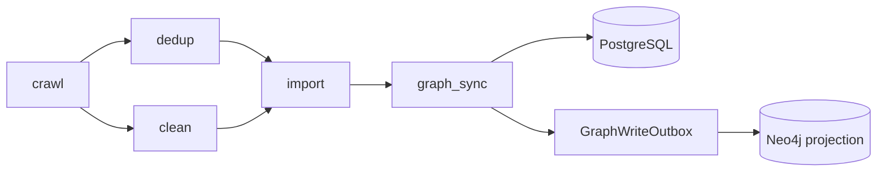

# 数据流水线

> 状态：活文档
> 最近核对：2026-07-24

StarMap 当前的 ETL 调度由 `backend/app/core/pipeline/orchestrator.py` 维护状态，`executor.py` 执行阶段，`backend/app/tasks/celery_app.py` 通过 Celery 分发任务。

## 当前阶段



| 阶段 | 作用 |
|---|---|
| `crawl` | 按启用的数据源配置采集并写入原始 JD 记录 |
| `dedup` | 精确/近似去重（Redis content-hash + SimHash），标记 duplicate |
| `clean` | 文本清理、规范化、标题提取（依赖 dedup 完成后执行） |
| `import` | LLM 技能抽取 + PG 持久化 |
| `graph_sync` | Neo4j 图投影（outbox 模式防漂移） |

`executor.py` 仍包含部分旧的细粒度执行函数，供兼容和组合调用；调度事实以 `STAGE_EXECUTORS` 与 `StageName` 为准。`timeseries` 为可选扩展阶段，不属于核心 ETL DAG。

## 运行与恢复

- `PipelineRun.stages` 持久化阶段状态、时间、进度、处理量和错误。
- 管理员可触发、取消、重试、恢复和处理卡死 run。
- Redis STOP flag 与数据库状态共同阻止取消后的阶段继续分发。
- SSE `/pipeline/events` 提供实时更新，轮询端点作为降级路径。
- 单阶段失败按依赖关系标记后续阶段；所有阶段终态后才结束 run。

## 其他流水线

- 闭环流程：`loop_orchestrator.py` 执行 JD -> 抽取 -> 图更新 -> 匹配 -> 学习路径。
- 求职者分析：`/pipeline/analyze` 以 SSE 返回简历解析、技能抽取、匹配和推荐过程。
- 演化流程：`run_evolution_pipeline` 是独立 Celery 周期任务，不属于当前三阶段 ETL DAG。
- 技能时间序列由演化服务刷新，不应被文档误写为当前 ETL 的必选阶段。

## 验证

```bash
# 需要已启动后端和管理员 token
python tests/e2e/pipeline_smoke_test.py
python tests/e2e/smoke_test.py --base-url http://localhost:8000 --all
```

单元测试应覆盖 DAG 就绪判断、失败传播、取消、重试、恢复、幂等和 outbox 状态转换。
---

## SSE 事件契约（Phase 03 Plan 03 Task 10，2026-08-11）

### 事件流来源

- 主连接：`GET /api/v1/pipeline/events`（SSE，`text/event-stream`）
- 轮询降级：`GET /api/v1/pipeline/events-poll?since=<unix_ts>`（JSON 数组）
- Redis pub/sub channel：`pipeline_update`（事件载荷详见后端 `sse/sse_pipeline_contracts.py`）

### 事件分类与字段

| 事件 | type 字段 | 必含字段 | 用途 |
|---|---|---|---|
| `stage.started` | `stage.started` | `run_id`, `stage`, `status="started"`, `event_id`, `ts` | 阶段开始（已通过 `pipeline_update` 包装） |
| `stage.progress` | `pipeline_update` | `run_id`, `stage`, `status="running"`, `progress`, `current_activity`, `elapsed_ms`, `event_id`, `ts` | 阶段内进度（每 10 条记录 / 60s） |
| `stage.sub_step` | `pipeline_update`（payload.sub_step 字段标识） | `run_id`, `stage`, `status="running"`, `sub_step`, `event_id`, `ts` | D-15 子步骤事件 |
| `stage.completed` | `pipeline_update` | `run_id`, `stage`, `status="completed"`, `progress=1.0`, `event_id`, `ts` | 阶段完成 |
| `stage.failed` | `pipeline_update` | `run_id`, `stage`, `status="failed"`, `error`, `event_id`, `ts` | 阶段失败 |
| `pipeline.completed` | （reserved） | `run_id`, `status="completed"`, `total_records`, `duration_ms`, `event_id`, `ts` | 全流水线完成（预留） |

### sub_step 命名约定（D-15）

| 阶段 | sub_step 取值 |
|---|---|
| `import` | `extract` / `normalize` / `persist` |
| `crawl` | `crawl:<source_name>`（每数据源一条） |
| `graph_sync` | `reconcile`（仅 `pipeline_graph_sync_reconcile_on_sync=True` 时） |
| 其他 | 无 sub_step 字段 |

### 幂等语义

- 所有事件携带全局唯一 `event_id`
- 客户端按 `last_event_id` 去重
- EventSource 原生支持 `Last-Event-ID` header 自续传
- 轮询 fallback 用 `since=<unix_ts>` 参数（基于 lastEventId 时间戳）

### 重连 / 降级协议

- 断开重试：指数退避（`baseDelay=1000ms`, `maxDelay=30000ms`）
- 连续 3 次失败切换轮询 fallback
- 轮询期间每 60s 重试 SSE 连接
- UI 提示：断开时顶部 `el-alert type="warning"`「实时推送已断开，切换轮询模式」+ 轮询 tag

### 前端订阅示例

```typescript
const { connected } = useSSE('/api/v1/pipeline/events', {
  storeHandlers: {
    'pipeline_update': (data) => {
      // data.sub_step 区分子步骤（D-15）
      if (data.sub_step?.startsWith('crawl:')) {
        // 数据源级进度
      } else if (data.sub_step === 'extract') {
        // LLM 抽取
      } else if (data.sub_step === 'normalize') {
        // 技能归一化
      } else if (data.sub_step === 'persist') {
        // PG 持久化
      } else if (data.sub_step === 'reconcile') {
        // PG↔Neo4j 对账
      }
    },
  },
  onError: () => { /* UI 降级提示 */ },
})
```

### 完整契约文档

后端：`backend/app/core/pipeline/sse/sse_pipeline_contracts.py`
- TypedDict 定义 6 类事件 schema
- 幂等/重连/降级协议注释
