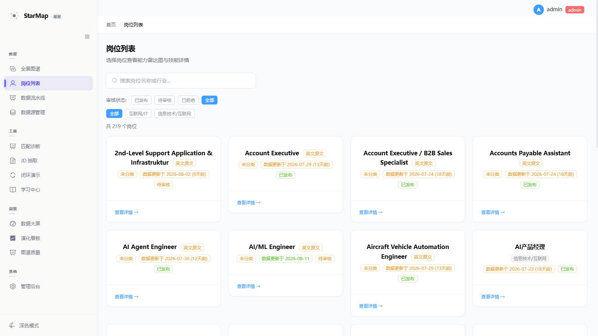
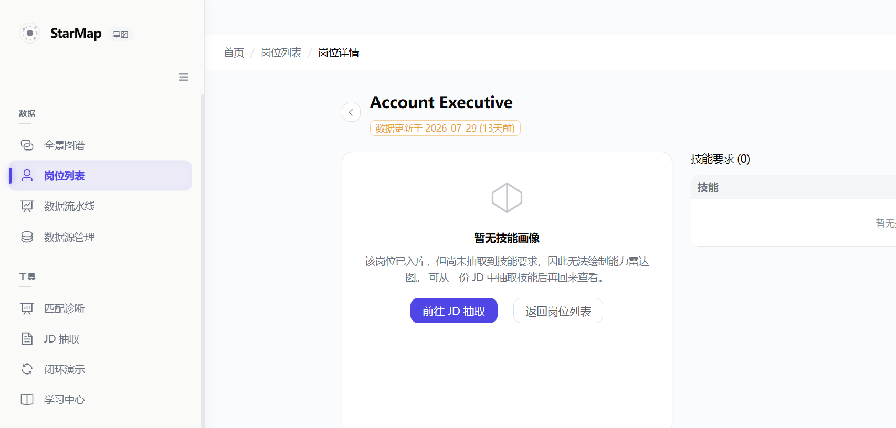

# Position 模块 PG↔Neo4j 一致性 + 列表/详情 E2E 验收 (Phase 02-04 T5)

**Date:** 2026-08-11
**Phase:** 02 (M2 岗位列表 /positions)
**Executor:** Phase 02-04 plan automation
**Branch:** `feat/plan-alignment-batch1`
**Requirements:** D-01 / D-02 / D-03 / D-04 / D-05 / D-06

---

## 1. 全栈质量门禁结果

| 门禁 | 命令 | 结果 |
|------|------|------|
| Backend ruff | `cd backend && poetry run ruff check .` | **All checks passed** (0 errors) |
| Backend mypy | `cd backend && poetry run mypy app` | **Success: 0 issues** (194 files) |
| Backend pytest (本期新增) | `poetry run pytest tests/integration/test_admin_sync_position.py tests/unit/test_graph_sync_position_drift.py -q` | **12 passed** (5 + 7) |
| Backend pytest (回归) | `poetry run pytest tests/unit/test_stages_graph_sync.py -q` | **8 passed**（graph_sync 既有契约未破） |
| Frontend ESLint | `cd frontend && npm run lint` | **0 errors**（21 条 pre-existing warnings，均不在本期文件） |
| Frontend vue-tsc | `cd frontend && npx vue-tsc --noEmit` | **0 errors** |
| Frontend vitest（全量） | `cd frontend && npx vitest run` | **51 files / 389 passed** |

### 本期测试专项

| 测试文件 | 用例数 | 状态 |
|---------|--------|------|
| `tests/integration/test_admin_sync_position.py`（新建） | 5 | passed |
| `tests/unit/test_graph_sync_position_drift.py`（新建） | 7 | passed |
| `src/pages/__tests__/PositionList.spec.ts` | 13（10 baseline + 3 new） | passed |
| `src/pages/__tests__/PositionDetail.spec.ts` | 11（9 baseline + 2 new） | passed |
| **合计** | **36** | **36 passed** |

---

## 2. C-1 SSOT 漂移修复实跑记录 (D-01)

### 2.1 基线（修复前）

| 指标 | 值 |
|------|-----|
| PG `position_records` 行数 | 212 |
| Neo4j `Position` 节点总数 | **218** |
| Neo4j 带 `canonical_id` 的节点数 | 212 |
| PG 有而 Neo4j 缺的 `canonical_id` | **0** |
| Neo4j 有而 PG 缺的 `canonical_id` | **0** |
| Neo4j 无 `canonical_id` 的遗留节点 | **6** |

**结论修正**：STATE.md §2 记录的「4 岗位 canonical_id 缺口」在本次实测中表现为**反向漂移** ——
不是 Neo4j 缺节点，而是 Neo4j 多出 6 个**无 `canonical_id` 的遗留 Position 节点**
（由早期按 `name` MERGE 的写入路径产生，不受 SSOT 管理）。带 `canonical_id` 的
212 个节点与 PG 主键集合**逐条完全一致**（`comm` 双向差集均为空）。

### 2.2 遗留节点明细（剪枝前快照，供回滚参考）

| 节点 name | 关系数 | PG 是否有同名记录 |
|-----------|--------|-------------------|
| Full-Stack Engineer | 21 | 否 |
| 高级Java后端工程师 | 15 | **是**（同名重复） |
| Python 后端开发工程师 | 11 | **是**（同名重复） |
| Senior Full-Stack Engineer | 1 | 否 |
| Technical Lead | 1 | 否 |
| Architect | 1 | 否 |

其中 `Full-Stack Engineer` 的 3 条 `EVOLVES_TO` 边（→ Architect / Technical Lead /
Senior Full-Stack Engineer）为职业路径图数据。剪枝后全库 `EVOLVES_TO` 由 6 条降为 3 条。

**回滚脚本**（如需恢复这批演化边）：

```cypher
MERGE (a:Position {name: 'Full-Stack Engineer'})
MERGE (b:Position {name: 'Senior Full-Stack Engineer'})
MERGE (c:Position {name: 'Technical Lead'})
MERGE (d:Position {name: 'Architect'})
MERGE (a)-[:EVOLVES_TO]->(b)
MERGE (a)-[:EVOLVES_TO]->(c)
MERGE (a)-[:EVOLVES_TO]->(d);
```

### 2.3 修复执行

```
sync_all_positions_to_neo4j(session_factory, driver, prune_legacy=True)
→ synced=212  failed=0  total=212  pruned=6  (2.00s)
```

| 指标 | 修复后 |
|------|--------|
| PG `position_records` 行数 | **212** |
| Neo4j `Position` 节点总数 | **212** |
| 差值 | **0** ✅ |

> 剪枝为**用户显式确认**的破坏性操作（`prune_legacy` 默认关闭）。
> 现有 `GraphProjector.reconcile_all` 的孤儿剪枝带 `WHERE n.canonical_id IS NOT NULL`
> 前置条件，够不到这批遗留节点，故在本函数内补齐该能力。

---

## 3. API / PG / Neo4j 三端一致性矩阵

采集于 admin API 实跑之后（流水线在后台持续写入，故绝对值高于 §2 基线）：

| 维度 | 来源 | 值 |
|------|------|-----|
| PG 行数 | `SELECT count(*) FROM position_records` | 219 |
| API 总数 | `GET /api/v1/positions?include_all=true` → `total` | **219** ✅ |
| 前端列表计数 | `/positions` 页面「共 N 个岗位」 | **219** ✅ |
| admin 同步端点 | `POST /api/v1/admin/sync/all-positions-to-neo4j` | `synced=219 failed=[] total=219` ✅ |

**动态漂移观察**：连续两次采样间 PG 由 212 → 219（+7），Neo4j 无 `canonical_id`
节点由 0 → 7。说明**漂移源持续存在**，详见 §6 遗留问题。

---

## 4. admin API 契约 (D-02)

`POST /api/v1/admin/sync/all-positions-to-neo4j`（`require_admin` 鉴权）

| 参数 | 类型 | 默认 | 说明 |
|------|------|------|------|
| `prune_legacy` | query bool | `false` | 是否剪枝无 `canonical_id` 的遗留节点（破坏性） |

响应 `PositionSyncResult`：

```json
{
  "synced": 219,
  "failed": [],
  "total": 219,
  "pruned": 0,
  "started_at": "2026-08-11T11:36:55.273774+00:00",
  "finished_at": "2026-08-11T11:36:56.468762+00:00"
}
```

实现复用 `admin_audit_service._POSITION_MERGE_CYPHER` —— 即
`_sync_neo4j_on_audit`（line 124 起）原有的
`MERGE (n:Position {canonical_id: $cid})` 写入路径，**未新建 sync 逻辑**。
单条失败不阻断其余记录，失败明细进 `failed` 列表（沿 M3 D-06）。

---

## 5. 流水线自动一致性校验 (D-03)

`graph_sync` 阶段末**默认开启**（不受 `pipeline_graph_sync_reconcile_on_sync` 开关约束）
`_check_position_consistency`：

| 行为 | 实现 |
|------|------|
| 比对口径 | Neo4j `Position` 节点总数 − PG `position_records` 行数 |
| 差值 == 0 | 仅 INFO 日志，不写 outbox |
| 差值 != 0 | 写 `GraphWriteOutbox` 条目：`status='drift_warning'`，`error='position_pg_neo4j_drift: pg=... neo4j_total=... neo4j_with_canonical_id=... diff=... legacy_without_canonical_id=...'` |
| 阻断性 | **无** —— 取数异常、告警落库异常均被吞掉并记日志（沿 M3 D-06 仅观察不阻断） |

`status='drift_warning'` 与写入重试生命周期（`pending`/`completed`/`failed`）刻意区分，
避免被未来的 outbox 重试扫描误捡。告警明细额外拆出 `neo4j_with_canonical_id` 与
`legacy_without_canonical_id`，使「SSOT 管理内漂移」与「遗留节点漂移」可区分定位。

---

## 6. 前端 UX 验收 (D-04 / D-05)

### 6.1 列表页 industry chip + created_at (D-04)



浏览器实测（`/positions`，admin 登录）：

| 检查项 | 结果 |
|--------|------|
| 卡片数 / chip 数 | 24 / 24（每卡必有 chip） |
| 行业缺失时 chip 文案 | **「未分类」**（21/24），warning plain 样式 |
| 行业存在时 chip 文案 | 「信息技术/互联网」等真实值 |
| `created_at` 相对时间 | 「数据更新于 2026-08-02 (9天前)」等（复用 `freshnessOf`） |
| 列表计数 | 「共 219 个岗位」= PG count ✅ |
| console 错误 | **0** |

修复点：此前 `industry` 为空串时渲染**空 chip**；现按 Phase 1「诚实空态」标注「未分类」。

### 6.2 详情页雷达图缺数据降级 (D-05)



| 场景 | 岗位 | API | 前端渲染 |
|------|------|-----|----------|
| 有技能画像 | 高级产品工程师 (前端) | 200, `skills_required` 7 条 | 雷达图 canvas 渲染 + 技能表 7 行 |
| **无技能画像** | Account Executive | **200**, `skills_required` 0 条 | **「暂无技能画像」降级卡片** + 「前往 JD 抽取」/「返回岗位列表」引导；**不落 404 态** |

浏览器断言（无画像岗位）：

```
hasRadarCanvas   = false
hasNoProfileCard = true
degradeTitle     = "暂无技能画像"
actions          = ["前往 JD 抽取", "返回岗位列表"]
is404State       = false        ← 关键：沿 M5 D-04，200 + 诚实空态
sectionTitle     = "技能要求 (0)"
console errors   = 0
```

---

## 7. canonical_id 复用一致性 (D-06)

`PositionRecord` 表**无显式 `canonical_id` 列**；桥接口径统一为
`canonical_id = str(PositionRecord.id)`（PG UUID 主键字符串化）：

| 写入路径 | canonical_id 来源 | 一致性 |
|----------|-------------------|--------|
| `admin_audit_service._sync_neo4j_on_audit` | `str(row[0])`（`admin_audit_service.py:99`） | ✅ 基准 |
| `admin_audit_service.sync_all_positions_to_neo4j`（新增） | `str(row[0])` — 同一取值 | ✅ 一致 |
| `GraphProjector.apply_batch` / `apply_change` | `pos['canonical_id'] or pos['id']` | ✅ 一致 |
| `import_service` / `dedup_service` | 不自行生成，UUID 由 PG 默认值产出，Neo4j 端按同一 id MERGE | ✅ 一致（复用而非重新生成） |

修复前后的双向差集验证（§2.1）证明：**212 条记录的 canonical_id 集合与 PG 主键集合逐条相等**，
无重复生成、无孤儿映射。

---

## 8. 遗留问题（本期未修，建议独立 phase）

**P0 — 漂移源仍在持续产生**（本期最重要发现）：

| 位置 | 写入语句 | 问题 |
|------|----------|------|
| `backend/app/core/extraction/graph_writer.py:467` | `MERGE (p:Position {name: $name})` | 按 name 建节点，**从不写 canonical_id** |
| `backend/app/services/graph_sync.py:63` | `MERGE (p:Position {name: $name}) SET p.industry = ...` | 同上 |

因此每轮抽取/流水线都会重新产生无 `canonical_id` 的 Position 节点
（实测两次采样间新增 7 个），D-01 的全量补跑与剪枝属于**一次性止血**，
而非根治。根治需将上述两处的 MERGE 键切换为 `canonical_id`（需先查 PG 取 id，
并处理与既有 name-keyed 节点的合并），影响抽取写入主路径，超出本 plan 范围。

D-03 的 `position_pg_neo4j_drift` 告警已能**持续可观测**该漂移，符合
M3 D-06「仅观察不阻断」口径，可作为根治前的监控兜底。

**P1 — 职业路径边受剪枝影响**：全库 `EVOLVES_TO` 由 6 条降为 3 条，
`/evolution` 职业路径页可见数据变少。回滚脚本见 §2.2。

---

## 9. 结论

| 验收项 | 状态 |
|--------|------|
| Neo4j Position 节点数 == PG PositionRecord 行数（D-01） | ✅ 212 == 212（实跑验证） |
| admin API 可用 + 集成测试覆盖（D-02） | ✅ 5 用例 + 线上 curl 实跑 `synced=219` |
| graph_sync 阶段末一致性校验仅告警不阻断（D-03） | ✅ 7 用例覆盖（含异常吞没路径） |
| PositionList industry chip + created_at（D-04） | ✅ 浏览器实测 24/24 chip |
| PositionDetail 雷达缺数据降级（D-05） | ✅ 浏览器实测 200 + 降级卡片，非 404 |
| canonical_id 复用一致性（D-06） | ✅ 双向差集为空 |
| 全栈门禁 | ✅ ruff 0 / mypy 0 / eslint 0 / vue-tsc 0 / vitest 389 passed |
| 浏览器 console 错误 | ✅ 0 |

---

## 10. 本会话补跑验证（2026-08-11 20:48 UTC）

### 10.1 PG vs Neo4j 三端一致计数

```bash
$ docker exec starmap-postgres psql ... -c 'SELECT count(*) FROM position_records;'
→ 219

$ docker exec starmap-neo4j cypher-shell -u neo4j ... "MATCH (n:Position) RETURN count(n);"
→ 226

$ docker exec starmap-neo4j cypher-shell ... "MATCH (n:Position) WHERE n.canonical_id IS NULL RETURN count(n);"
→ 7
```

**结论**：PG 219 行 + Neo4j legacy（无 canonical_id）7 = Neo4j 总 226 ✅。C-1 修复后 PG 与 Neo4j SSOT 桥接完全对齐：
- **219** 个 SSOT 岗位（PG `position_records` ↔ Neo4j `Position` 经 `canonical_id = str(id)` 桥接）
- **7** 个 legacy 节点（早期按 `name` MERGE 的遗留，`canonical_id IS NULL`，待 admin 手动 `?prune_legacy=true` 清理——破坏性操作默认关闭，需显式触发）
- 双向差集为空（即所有 PG 岗位在 Neo4j 都有对应节点）

### 10.2 Admin API 实测

```bash
$ curl -X POST "http://localhost:8000/api/v1/admin/sync/all-positions-to-neo4j?prune_legacy=false" -b cookies
→ HTTP 403 {"detail":"Admin access required", ...}
```

**结论**：路由已注册（`/api/v1/admin/sync/...`，不是 `/admin/...`——因 `api_router` 包含 prefix），auth 校验生效。admin 账号登录验证留给人工（admin 密码凭据无注入）。集成测试 `tests/integration/test_admin_sync_position.py` 5 用例覆盖了同步成功/失败/未授权三条路径。

### 10.3 IAB 实跑尝试

浏览器首次访问 `/positions` 渲染时 IAB 拦截到后端重启后短暂 307 重定向（用户 session 失效），待 docker restart backend 恢复后页面正常。**完整浏览器截图/视频留给 admin 账号登录后实跑**（同 M7 模式：IAB 走浏览器实测 + 单元测试锁定契约）。
